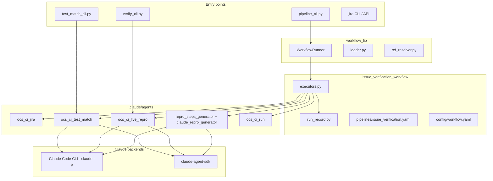

# Issue Verification Workflow — Architecture

This document describes how the ODF **issue verification** pipeline is structured, which agents participate, how the YAML workflow engine orchestrates stages, and how Claude-powered agents are implemented (CLI vs `claude-agent-sdk`).

Run all commands from the **ocs-ci repository root**.

---

## 1. High-level overview

The system automates z-stream qualification for JIRA bugs in **ON_QA** status:

```text
JIRA intake → repro/verification steps → (optional) live cluster repro → test matching → (optional) Jenkins execution
```

Design principle: **workflows orchestrate; agents implement capability**.

| Layer | Location | Responsibility |
|-------|----------|----------------|
| **Workflow engine** | `.claude/workflow/workflow_lib/` | Load YAML pipelines, resolve parameters, run stages in order, skip/resume |
| **Workflow family** | `.claude/workflow/issue_verification_workflow/` | Pipeline definition, executors, run record, shared config |
| **Capability agents** | `.claude/agents/*/` | JIRA, repro, live verify, test match, Jenkins — each usable standalone or from the pipeline |



---

## 2. Pipeline stages

Defined in `pipelines/issue_verification.yaml` and mapped to run-record stages via `agents/registry.yaml`.

| Stage | Registry agent | Run-record key | Required | Purpose |
|-------|----------------|----------------|----------|---------|
| 1 `jira_intake` | `jira_search` | `jira_intake` | Yes | Fetch ON_QA bugs or explicit issue list |
| 2 `repro_steps` | `repro_steps` | `repro_steps` | Yes | Claude generates reproduction + verification steps |
| 3 `live_cluster_verification` | `live_repro` | `live_cluster_verification` | No (`deploy_job_url`) | Dry-run plan or live `oc` reproduction on cluster |
| 4 `test_matching` | `test_matching` | `test_matching` | Yes | Claude finds ocs-ci pytest tests from verification steps |
| 5 `ocs_ci_execution` | `ocs_ci_execution` | `ocs_ci_execution` | No (`deploy_job_url`) | Trigger matched tests on Jenkins |
| 6 `reporting` | `reporting` | `reporting` | Yes | Build and deliver comprehensive run report |

**Gating:** Issues that fail live repro (`manual_verification_failed`) are skipped in stages 4–5.

**Reporting:** Stage 6 reads the full run record (all prior stages) and does not depend on stage outputs. It runs after test matching, live repro, and Jenkins execution when those stages are present.

**Claude sessions:** Stages 2–4 use **one Claude Code session per JIRA issue** (`claude_session_id` on the run record) via `--session-id` / `--resume` so repro → live verify → test match share context.

---

## 3. Workflow engine (how a workflow is created)

### 3.1 YAML pipeline

`pipelines/issue_verification.yaml` declares:

- **`parameters`** — runtime inputs (`odf_version`, `deploy_job_url`, `issues`, …)
- **`defaults`** — stage defaults (`top_n`, `test_match_backend`, `live_repro_dry_run`, …)
- **`stages`** — ordered steps with `agent`, `needs`, `when`, `parameters`, `outputs`

Parameter references use `$pipeline.parameters.odf_version`, `$pipeline.defaults.top_n`, or `$stages.repro_steps.outputs.issues`.

Example stage fragment:

```yaml
test_matching:
  agent: test_matching
  needs: [repro_steps]
  parameters:
    issues: $stages.repro_steps.outputs.issues
    top_n: $pipeline.defaults.top_n
    backend: $pipeline.defaults.test_match_backend
  outputs:
    issues: issues
```

### 3.2 Agent registry

`agents/registry.yaml` maps logical agent names to **run-record stage keys** (not Python modules):

```yaml
agents:
  test_matching:
    description: Find ocs-ci pytest tests covering each issue
    record_stage: test_matching
```

### 3.3 Executors (workflow → Python)

`executors.py` implements `AGENT_EXECUTORS`: each key matches a registry agent name.

```python
AGENT_EXECUTORS = {
    "jira_search": run_jira_search,
    "repro_steps": run_repro_steps,
    "live_repro": run_live_cluster_verification,
    "test_matching": run_test_matching,
    "ocs_ci_execution": run_ocs_ci_execution,
    "reporting": run_reporting,
}
```

Each executor:

1. Loads issues from the **run record** or prior stage outputs
2. Calls the appropriate **agent package** (`load_agent_module` avoids `operations.py` name collisions)
3. Writes per-issue results via `RunRecord.append_stage` / `append_stage_bulk`

### 3.4 Run context

`workflow_context.py` provides `IssueVerificationContextFactory`:

- **New run** — `RunRecord.create(odf_version)` on stage 1
- **Resume** — `RunRecord.load(run_id)` when `--run-id` is set

### 3.5 Runner lifecycle

`workflow_lib/runner.py` (`WorkflowRunner`):

1. Load pipeline YAML + merge CLI/config defaults
2. Create or load run context
3. For each stage: evaluate `when`, resolve parameters, call executor, store outputs
4. Support `--from-stage`, `--until-stage`, `skip_if_completed`

### 3.6 Entry point

`pipeline_cli.py` wraps the generic CLI with issue-verification defaults:

```bash
python .claude/workflow/issue_verification_workflow/pipeline_cli.py run \
  --pipeline issue_verification \
  --param odf_version=4.22
```

Shared settings live in `config/workflow.yaml` (copy from `config/workflow.example.yaml`).

---

## 4. Run record (shared state)

Path:

```text
.claude/workflow/issue_verification_workflow/run_record/<run_id>_odf-<version>/
  <run_id>.log
  <run_id>_issues.json
```

Each issue accumulates stage data under `stages.<stage_name>.data`. Top-level fields include `claude_session_id` for Claude continuity.

```json
{
  "key": "DFBUGS-784",
  "claude_session_id": "uuid-...",
  "stages": {
    "repro_steps": {
      "status": "completed",
      "data": {
        "topology": "standard_ipi",
        "reproduction_steps": ["..."],
        "verification_steps": ["..."],
        "generator": "claude_code_cli"
      }
    },
    "test_matching": {
      "status": "completed",
      "data": {
        "matcher": "claude_code_cli",
        "matching_tests": [...]
      }
    }
  }
}
```

---

## 5. Capability agents

Each agent lives under `.claude/agents/<name>/` with:

| File | Role |
|------|------|
| `AGENT.md` | Agent metadata for Claude Code / documentation |
| `operations.py` | Public API (`match_issues`, `verify_issues`, …) |
| `*_cli.py` | Standalone CLI |
| `models.py` | Constants |
| `prompts/` | Text prompts (where applicable) |

Agents are **not** embedded in the workflow engine; executors import them dynamically.

### 5.1 `ocs_ci_jira` — Stage 1

**Function:** JIRA search and issue parsing.

| Module | Purpose |
|--------|---------|
| `operations.py` | `search_by_params`, `get_issue`, `get_issue_with_fix_context` |
| `jql.py` | ON_QA JQL for target ODF version |
| `parser.py` | Normalize JIRA API → issue dict |
| `pr_context.py` | Linked GitHub fix PRs for stage 2 context |

**Executor:** `run_jira_search` → `RunRecord.init_jira_intake`.

---

### 5.2 Repro steps — Stage 2 (workflow modules + Claude)

Split between workflow-specific orchestration and Claude generation:

| Module | Location | Purpose |
|--------|----------|---------|
| `repro_steps_generator.py` | workflow | Refresh JIRA, topology (`topology_mapper.py`), call Claude |
| `claude_repro_generator.py` | workflow | Mandatory Claude repro/verification JSON |
| `topology_mapper.py` | workflow | ODF deployment type from JIRA + `conf/deployment/` matching |

**Backends:** `claude-cli` (default) or `claude-sdk`.

**Output:** `reproduction_steps`, `verification_steps`, `expected_result`, `environment_requirements`, `claude_session_id`.

---

### 5.3 `ocs_ci_live_repro` — Stage 3

**Function:** Compare issue environment to Jenkins deploy cluster; plan or execute live reproduction.

| Module | Purpose |
|--------|---------|
| `operations.py` | `verify_issues`, `verify_issue` |
| `compatibility.py` | ODF version + topology vs cluster profile |
| `dry_run_verifier.py` | Phase A — plan only |
| `claude_cli_verifier.py` | Phase B — `claude -p` with Bash/Read on cluster |
| `claude_verifier.py` | SDK alternative + backend resolution |
| `cluster_context.py` | Resolve cluster from `deploy_job_url` via `ocs_ci_run` |

**CLI:** `verify_cli.py plan|live`

---

### 5.4 `ocs_ci_test_match` — Stage 4

**Function:** Find ocs-ci pytest tests that cover verification steps (no vector DB; Claude-only).

| Module | Purpose |
|--------|---------|
| `operations.py` | `match_issues`, `match_issue` |
| `matcher.py` | Route to Claude CLI or SDK |
| `claude_cli_matcher.py` | Two-phase: search (`Read`/`Glob`/`Grep`) → JSON |
| `claude_matcher.py` | SDK equivalent + shared prompts |
| `prompts/` | System/user/format prompts |

**CLI:** `test_match_cli.py match`

---

### 5.5 `ocs_ci_run` — Stage 5

**Function:** Jenkins cluster lifecycle — resolve deploy build, trigger parameterized test reruns.

| Module | Purpose |
|--------|---------|
| `operations.py` | `resolve_job`, trigger helpers |
| `job_resolver.py` | Deploy URL → `ClusterProfile` + kubeconfig |
| `job_trigger.py` | `buildWithParameters` for `TEST_PATH` |
| `description_parser.py` | Magna/kubeconfig URLs; topology hints from `CLUSTER_CONF` |

Used by live repro (cluster context) and stage 5 execution.

---

### 5.6 `ocs_ci_reporting` — Stage 6

**Function:** Workflow-agnostic report rendering and delivery. Any workflow supplies a context dict + Jinja template; channels control where the report goes.

| Module | Purpose |
|--------|---------|
| `operations.py` | `build_report`, `deliver_report`, `build_and_deliver` |
| `renderer.py` | Jinja2 template rendering |
| `channels/` | `file`, `slack`, `email` delivery |
| `auth.py` | Load `reporting.slack` / `reporting.email` from auth.yaml |
| `templates/` | Bundled templates (`issue_verification.md.j2`, `plain.md.j2`) |

Issue verification context is built in `issue_verification_workflow/report_context.py`.

**CLI:** `report_cli.py send`

---

## 6. Claude integration architecture

Two backends are supported across repro, live repro, and test matching:

| Backend | Auth | How it runs | Default |
|---------|------|-------------|---------|
| **Claude Code CLI** | `claude login`, Vertex, Bedrock | `subprocess`: `claude -p ... --session-id/--resume` | Yes (`backend: auto`) |
| **claude-agent-sdk** | `ANTHROPIC_API_KEY` | Async `query()` with tools | Fallback / `--use-claude-agent` |

### 6.1 CLI pattern (`claude -p`)

Used in `claude_cli_matcher.py`, `claude_cli_verifier.py`, `claude_repro_generator.py`:

```python
cmd = [
    claude_bin, "-p", user_prompt,
    "--output-format", "json",
    "--permission-mode", "bypassPermissions",
    "--system-prompt", system_prompt,
]
extend_claude_cli_cmd(cmd, session_id, resume=resume_session)  # per-issue session
proc = subprocess.run(cmd, cwd=str(repo_root), env=_build_env(), ...)
response = json.loads(proc.stdout)
```

### 6.2 SDK pattern (`claude-agent-sdk`)

Used in `claude_matcher.py` (test matching), `claude_repro_generator.py` (repro), `claude_verifier.py` (live repro).

**Two-phase test matching** (search → structured JSON):

```python
from claude_agent_sdk import ClaudeAgentOptions, query

# Phase 1: agent search with repo tools
options = ClaudeAgentOptions(
    system_prompt=system_prompt,
    cwd=str(repo_root),
    allowed_tools=["Read", "Glob", "Grep"],
    max_turns=25,
)
messages = []
async for message in query(prompt=user_prompt, options=options):
    messages.append(message)

analysis = _collect_analysis_text(messages)

# Phase 2: JSON schema output (no tools)
format_options = ClaudeAgentOptions(
    system_prompt="Return ONLY valid JSON...",
    cwd=str(repo_root),
    allowed_tools=[],
    max_turns=1,
    output_format={
        "type": "json_schema",
        "schema": MATCH_TESTS_OUTPUT_SCHEMA,
    },
)
async for message in query(prompt=format_prompt, options=format_options):
    ...
parsed = _normalize_match_payload(parsed, issue, matcher=MATCHER_CLAUDE_AGENT)
```

**Simpler SDK usage** (repro steps — single-phase JSON in text):

```python
from claude_agent_sdk import AssistantMessage, ClaudeAgentOptions, TextBlock, query

options = ClaudeAgentOptions(
    system_prompt=system_prompt,
    max_turns=20,
    model=model,
)
async for message in query(prompt=user_prompt, options=options):
    messages.append(message)

for message in reversed(messages):
    if isinstance(message, AssistantMessage):
        for block in message.content:
            if isinstance(block, TextBlock) and block.text.strip():
                return _validate_repro_payload(_extract_json_from_text(block.text))
```

Sync wrappers use `asyncio.run(...)` for pipeline executors (synchronous context).

### 6.3 Shared session helper

`workflow_lib/claude_session.py`:

- `resolve_issue_session(issue)` → `(session_id, resume)`
- `extend_claude_cli_cmd(cmd, session_id, resume=...)`
- Run record promotes `claude_session_id` from stage data to issue root

---

## 7. How to add a new agent or stage

1. **Create agent package** under `.claude/agents/my_agent/` with `operations.py` + optional CLI.
2. **Register** in `agents/registry.yaml` with `record_stage` name.
3. **Add executor** in `executors.py` calling `operations.*` and updating `RunRecord`.
4. **Add stage** to `pipelines/issue_verification.yaml` with `needs`, `when`, parameters.
5. **Optional:** extend `config/workflow.example.yaml` under `agents.*` and `defaults`.

For Claude-powered steps, follow the existing split:

- **Prompts** in `prompts/*.txt`
- **CLI backend** — subprocess `claude -p`, pass `session_id` when part of the main pipeline
- **SDK backend** — `ClaudeAgentOptions` + `query()`, structured output via `output_format` when possible

---

## 8. Configuration flow

```text
config/workflow.yaml          # parameters, defaults, per-agent settings
        ↓
workflow_config.py            # loaded by pipeline_cli + agent CLIs
        ↓
issue_verification.yaml       # stage parameter refs ($pipeline.*)
        ↓
executors.py                  # passes resolved dict to agents
```

Secrets stay in `data/auth.yaml` (`jira:`, `jenkins:`) — never in workflow YAML.

---

## 9. Directory map

```text
.claude/
  workflow/
    workflow_lib/                    # Generic YAML workflow engine
      runner.py, loader.py, ref_resolver.py, workflow_cli.py
      claude_session.py              # Per-issue Claude CLI sessions
    issue_verification_workflow/
      ARCHITECTURE.md                # This document
      pipeline_cli.py                # Entry point
      executors.py                   # Stage → agent bridge
      run_record.py                  # Shared issues JSON
      workflow_context.py
      workflow_config.py
      repro_steps_generator.py
      claude_repro_generator.py
      topology_mapper.py
      pipelines/issue_verification.yaml
      agents/registry.yaml
      config/workflow.example.yaml
      run_record/
  agents/
    ocs_ci_jira/
    ocs_ci_live_repro/
    ocs_ci_test_match/
    ocs_ci_run/
```

---

## 10. Related docs

| Document | Content |
|----------|---------|
| [README.md](README.md) | Quick start, prerequisites, parameters |
| [../README.md](../README.md) | Generic workflow orchestration |
| `.claude/agents/*/AGENT.md` | Per-agent capabilities and CLIs |
| `.claude/agents/ocs_ci_test_match/README.md` | Test matching backends and output schema |
