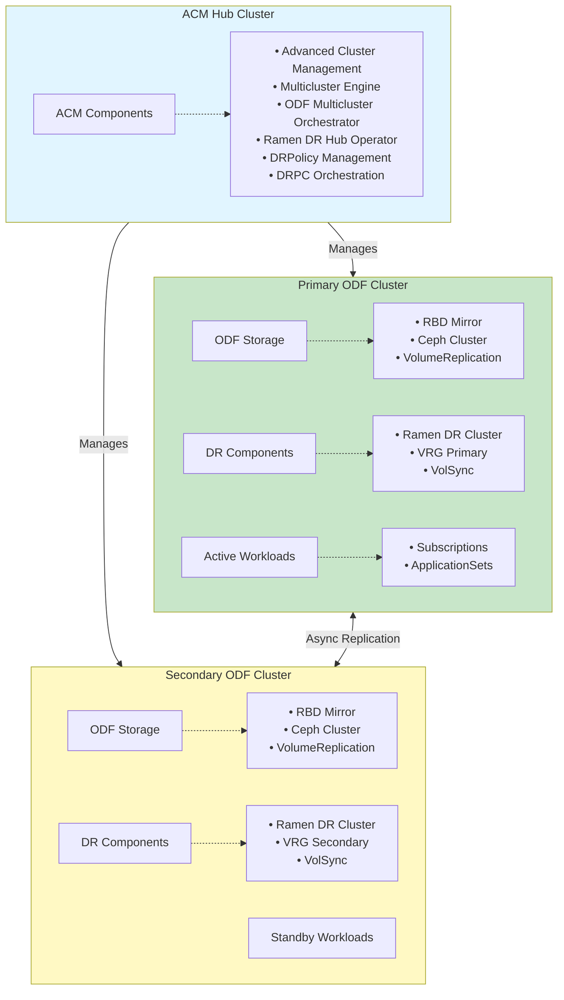
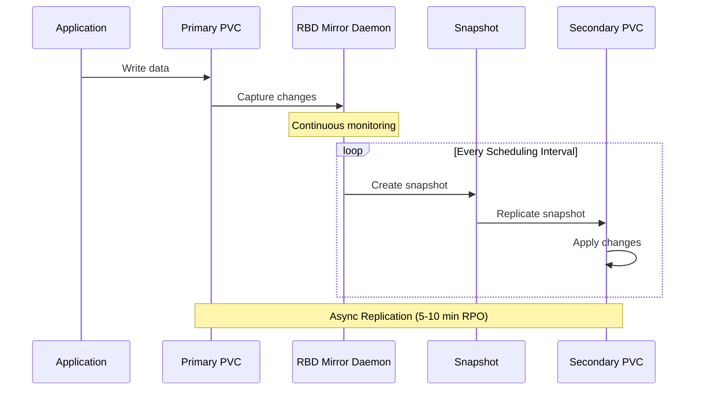

# Regional Disaster Recovery (RDR) Architecture and Deployment in ocs-ci

## Table of Contents
1. [Overview](#overview)
2. [RDR Architecture](#rdr-architecture)
3. [Key Components](#key-components)
4. [Multicluster Access Patterns](#multicluster-access-patterns)
5. [OCS-CI Deployment Flow](#ocs-ci-deployment-flow)
6. [Important Design Pieces](#important-design-pieces)
7. [Configuration and Constants](#configuration-and-constants)

---

## Overview

Regional Disaster Recovery (RDR) is a disaster recovery solution for OpenShift Data Foundation (ODF) that enables asynchronous replication of persistent volumes across geographically distributed OpenShift clusters. RDR provides application failover and relocate capabilities between a primary and secondary cluster.

**Key Characteristics:**
- **Mode**: `regional-dr` (async replication)
- **Replication Policy**: Asynchronous (`async`)
- **Cluster Roles**: ActiveACM (Hub), PrimaryODF, SecondaryODF
- **Storage Types**: RBD (Ceph Block) and CephFS (Ceph Filesystem)
- **Deployment Modes**: Greenfield and Brownfield

---

## RDR Architecture

### High-Level Architecture



### Network Connectivity

RDR requires network connectivity between clusters:
- **Submariner** : Provides secure Layer 3 connectivity
- **Globalnet**: Enables overlapping CIDR ranges
- **S3 Storage**: For metadata and backup storage
- **Latency Requirement**: < 10ms RTT for hub-spoke communication

---

## Key Components

### 1. ACM Hub Cluster Components

#### Advanced Cluster Management (ACM)
- **Purpose**: Central management and orchestration
- **Version**: 2.12+
- **Key Functions**:
  - Cluster lifecycle management
  - Application deployment via GitOps
  - Policy enforcement
  - Observability

#### Multicluster Engine (MCE)
- **Purpose**: Cluster provisioning and management
- **Deployment**: Installed on ACM hub
- **Functions**: Cluster import, managed cluster lifecycle

#### ODF Multicluster Orchestrator
- **Deployment**: `odf-multicluster-orchestrator-controller-manager`
- **Namespace**: `openshift-operators`
- **Purpose**: Coordinates storage operations across clusters
- **Key Resources**:
  - MirrorPeer: Defines replication relationships
  - StorageClusterPeer: Manages peer connections

#### Ramen DR Hub Operator
- **Purpose**: DR orchestration and policy management
- **Key CRDs**:
  - `DRPolicy`: Defines DR policies and scheduling intervals
  - `DRPlacementControl (DRPC)`: Controls application placement
  - `DRCluster`: Represents managed clusters in DR topology

### 2. Managed Cluster (Primary/Secondary) Components

#### ODF Storage Cluster
- **Components**:
  - Ceph cluster (Mon, OSD, MGR)
  - RBD provisioner
  - CephFS provisioner
  - Storage classes

#### RBD Mirroring
- **Purpose**: Asynchronous block storage replication
- **Components**:
  - `rbd-mirror` pods
  - Volume Replication CRDs
  - Replication secrets
- **Deployment Modes**:
  - **Greenfield**: New deployments with `bluestore-rdr` annotation
  - **Brownfield**: Existing deployments

#### Ramen DR Cluster Operator
- **Label**: `app=ramen-dr-cluster`
- **Purpose**: Local DR operations on managed clusters
- **Key CRDs**:
  - `VolumeReplicationGroup (VRG)`: Groups PVCs for replication
  - `VolumeReplication`: Per-PVC replication control

#### VolSync (ODF 4.19+)
- **Purpose**: CephFS replication using Restic/Rclone
- **Storage Class**: `ocs-storagecluster-cephfs-vrg`
- **Components**:
  - ReplicationSource
  - ReplicationDestination

#### Token Exchange Agent
- **Label**: `app=token-exchange-agent`
- **Purpose**: Secure credential exchange between clusters
- **Namespace**: `openshift-storage`

### 3. Workload Types

#### Subscription-based Applications (Soon to be Deprecated)
- **Namespace**: Application-specific
- **DRPC Location**: Application namespace
- **GitOps**: ACM ApplicationSet or Subscription

#### ApplicationSet-based Applications
- **Namespace**: `openshift-gitops`
- **DRPC Location**: `openshift-gitops`
- **GitOps**: ArgoCD ApplicationSet

#### Discovered Applications
- **Purpose**: Protect existing applications without GitOps
- **DRPC Location**: `openshift-dr-ops`
- **Features**:
  - KubeObject protection
  - Recipe-based backup
  - Multi-namespace support

---

## Multicluster Access Patterns

### Context Switching in ocs-ci

The framework uses context switching to manage multiple clusters:

```python
# Switch to ACM hub cluster
config.switch_acm_ctx()

# Switch to primary cluster
primary_config = get_primary_cluster_config()
config.switch_ctx(primary_config.MULTICLUSTER["multicluster_index"])

# Switch by cluster name
config.switch_to_cluster_by_name("cluster-name")
```

### Cluster Roles and Indexes

```python
# RDR Roles
RDR_ROLES = ["ActiveACM", "PrimaryODF", "SecondaryODF"]

# Optional: PassiveACM for dual-hub scenarios
if get_passive_acm_index():
    RDR_ROLES.append("PassiveACM")

# Cluster ranking
ACM_RANK = 1
MANAGED_CLUSTER_RANK = 2
```

### DRPC Access Patterns

```python
# Get current primary cluster
primary_cluster_name = dr_helpers.get_current_primary_cluster_name(
    namespace=workload_namespace,
    workload_type=constants.SUBSCRIPTION
)

# Get current secondary cluster
secondary_cluster_name = dr_helpers.get_current_secondary_cluster_name(
    namespace=workload_namespace,
    workload_type=constants.SUBSCRIPTION
)

# Access DRPC object
drpc_obj = DRPC(namespace=workload_namespace)
drpc_data = drpc_obj.get()

# Check DRPC action
if drpc_data["spec"]["action"] == constants.ACTION_FAILOVER:
    current_cluster = drpc_data["spec"]["failoverCluster"]
else:
    current_cluster = drpc_data["spec"]["preferredCluster"]
```

### Replication Resource Access

```python
# Check VolumeReplicationGroup state
vrg_obj = OCP(
    kind=constants.VOLUME_REPLICATION_GROUP,
    namespace=workload_namespace
)

# Check mirroring status on primary
config.switch_to_cluster_by_name(primary_cluster_name)
dr_helpers.wait_for_mirroring_status_ok(
    replaying_images=pvc_count
)

# Verify replication destinations on secondary
config.switch_to_cluster_by_name(secondary_cluster_name)
dr_helpers.wait_for_replication_destinations_creation(
    pvc_count, workload_namespace
)
```

---

## OCS-CI Deployment Flow

### Phase 1: Infrastructure Setup

```
1. ACM Hub Cluster Deployment
   ├── Deploy OpenShift cluster
   ├── Install ACM operator
   ├── Install MCE operator
   └── Configure observability

2. Managed Clusters Deployment (Primary & Secondary)
   ├── Deploy OpenShift clusters via ACM
   │   ├── Create/import cluster prerequisites
   │   ├── Create/import cluster via ACM UI/CLI
   │   └── Wait for cluster ready
   ├── Install ODF operator
   ├── Create StorageCluster
   └── Verify ODF deployment
```

### Phase 2: DR Infrastructure Setup

```
3. DR Operators Deployment
   ├── On ACM Hub:
   │   ├── Deploy ODF Multicluster Orchestrator
   │   │   └── Verify deployment available
   │   ├── Enable MCO console plugin
   │   └── Create ServiceExporter (4.19+)
   │
   └── On Managed Clusters:
       ├── Enable RBD mirroring on StorageCluster
       ├── Deploy Ramen DR Cluster Operator
       └── Configure S3 secrets for DR

4. Network Configuration (if Submariner enabled)
   ├── Download subctl CLI
   ├── Deploy broker on primary cluster
   ├── Join clusters to broker
   └── Verify connectivity
```

### Phase 3: DR Configuration

```
5. MirrorPeer Creation
   ├── Load MirrorPeer template (MIRROR_PEER_RDR)
   ├── Update cluster names in spec
   ├── Apply MirrorPeer on ACM hub
   └── Validate MirrorPeer status
       ├── Check phase: "ExchangedSecret"
       ├── Verify token-exchange-agent pods
       └── Verify rbd-mirror pods

6. DRPolicy Creation
   ├── Load DRPolicy template
   ├── Configure:
   │   ├── drClusters: [primary, secondary]
   │   ├── schedulingInterval: "5m" (default)
   │   └── replicationClassSelector (for RBD)
   ├── Apply DRPolicy on ACM hub
   └── Validate DRPolicy status: "Validated"

7. StorageClusterPeer Validation (4.19+)
   ├── Verify peer state on both clusters
   └── Verify VolSync deployment
```

### Phase 4: Workload Deployment

```
8. Application Deployment with DR Protection
   ├── Deploy application (Subscription/ApplicationSet)
   ├── Create DRPC resource
   │   ├── Specify drPolicyRef
   │   ├── Set preferredCluster (primary)
   │   └── Set placementRef
   ├── Wait for VRG creation
   ├── Wait for VolumeReplication resources
   └── Verify initial replication

9. Verify DR Readiness
   ├── Check DRPC conditions:
   │   ├── PeerReady: True
   │   └── ClusterDataProtected: True
   ├── Verify mirroring status
   └── Verify replication destinations
```

### Deployment Class Hierarchy

```
Deployment (base class)
    ├── do_deploy_rdr()
    │   └── Calls get_multicluster_dr_deployment()
    │
    └── get_rdr_conf()
        └── Returns DR configuration dict

MultiClusterDROperatorsDeploy (base DR class)
    ├── deploy_dr_multicluster_orchestrator()
    ├── configure_mirror_peer()
    ├── deploy_dr_policy()
    └── enable_acm_observability()

RDRMultiClusterDROperatorsDeploy (RDR-specific)
    └── deploy()
        ├── Deploy orchestrator on all ACM hubs
        ├── Enable MCO console plugin
        ├── Create ServiceExporter (4.19+)
        ├── Configure MirrorPeer
        ├── Deploy RBD DR operations
        ├── Enable ACM observability
        ├── Deploy DRPolicy
        ├── Validate StorageClusterPeer (4.19+)
        └── Configure backup (if needed)
```

### Key Deployment Methods

#### [`Deployment.do_deploy_rdr()`](ocs_ci/deployment/deployment.py:689)
```python
def do_deploy_rdr(self):
    """Call Regional DR deploy"""
    if config.ENV_DATA.get("skip_dr_deployment", False):
        return
    if config.multicluster:
        dr_conf = self.get_rdr_conf()
        deploy_dr = get_multicluster_dr_deployment()(dr_conf)
        deploy_dr.deploy()
```

#### [`RDRMultiClusterDROperatorsDeploy.deploy()`](ocs_ci/deployment/deployment.py:3896)
Main deployment orchestration for RDR setup.

#### [`MultiClusterDROperatorsDeploy.configure_mirror_peer()`](ocs_ci/deployment/deployment.py:3230)
Creates and validates MirrorPeer resource.

#### [`MultiClusterDROperatorsDeploy.deploy_dr_policy()`](ocs_ci/deployment/deployment.py:3400)
Creates DRPolicy with cluster relationships.

---

## Important Design Pieces

### 1. Asynchronous Replication

**Scheduling Interval**: Defines RPO (Recovery Point Objective)
- Default: 5 minutes
- IBM Cloud Managed: 10 minutes
- Configurable via DRPolicy

**Replication Flow**:



### 2. Failover vs Relocate

#### Failover (Disaster Scenario)
- **Trigger**: Primary cluster unavailable
- **Action**: `spec.action: Failover`
- **Target**: `spec.failoverCluster`
- **Process**:
  1. Detect primary cluster failure
  2. Update DRPC with failover action
  3. Promote secondary VRG to primary
  4. Start application on secondary
  5. Delete resources from primary (when available)

#### Relocate (Planned Migration)
- **Trigger**: Planned move to another cluster
- **Action**: `spec.action: Relocate`
- **Target**: `spec.preferredCluster`
- **Process**:
  1. Ensure both clusters healthy
  2. Update DRPC with relocate action
  3. Quiesce application on current primary
  4. Ensure final sync complete
  5. Promote new primary VRG
  6. Start application on new primary
  7. Demote old primary VRG to secondary

### 3. VolumeReplicationGroup (VRG)

**Purpose**: Groups PVCs for coordinated replication

**States**:
- `Primary`: Active cluster with read/write access
- `Secondary`: Standby cluster receiving replicated data

**Key Responsibilities**:
- Manage VolumeReplication resources
- Coordinate snapshots
- Handle promotion/demotion
- Manage PVC protection

### 4. Consistency Groups (4.21+)

**Purpose**: Ensure crash-consistent snapshots across multiple PVCs

**Configuration**:
```python
# Enabled by default in RDR mode for 4.21+
cg_enabled = config.ENV_DATA.get("cg_enabled", True)
```

**Benefits**:
- Application-consistent backups
- Coordinated snapshot timing
- Reduced RPO for multi-PVC applications

### 5. OSD Deployment Modes

#### Greenfield (4.14-4.17)
```yaml
metadata:
  annotations:
    ocs.openshift.io/clusterIsDisasterRecoveryTarget: "true"
```
- OSDs deployed with `bluestore-rdr` store type
- Optimized for DR workloads
- Automatic configuration

#### Brownfield
- Existing OSD deployments
- Standard bluestore
- Manual DR configuration

### 6. Hub Recovery and Backup

**Backup Components**:
- ACM resources
- DR policies
- Cluster configurations

**Backup Schedule**:
- Resource: `schedule-acm`
- Namespace: ACM namespace
- Policy: `backup-restore-enabled`

**Recovery Process**:
```python
configure_rdr_hub_recovery()
    ├── Create backup schedule
    ├── Validate DPA (Data Protection Application)
    └── Verify policy compliance
```

---

## Configuration and Constants

### Key Constants

#### Mode and Policy
```python
RDR_MODE = "regional-dr"
RDR_REPLICATION_POLICY = "async"
RDR_DR_POLICY_IBM_CLOUD_MANAGED = "odr-policy-10m"
```

#### OSD Deployment
```python
RDR_OSD_MODE_GREENFIELD = "greenfield"
RDR_OSD_MODE_BROWNFIELD = "brownfield"
```

#### Storage Classes
```python
RDR_VOLSYNC_CEPHFILESYSTEM_SC = "ocs-storagecluster-cephfs-vrg"
RDR_CUSTOM_RBD_POOL = "rdr-test-storage-pool"
RDR_CUSTOM_RBD_STORAGECLASS = "rbd-cnv-custom-sc"
```

#### Namespaces
```python
DR_DEFAULT_NAMESPACE = "openshift-dr-system"
DR_OPS_NAMESPACE = "openshift-dr-ops"  # For discovered apps
```

#### Labels
```python
TOKEN_EXCHANGE_AGENT_LABEL = "app=token-exchange-agent"
RBD_MIRROR_APP_LABEL = "app=rook-ceph-rbd-mirror"
RAMEN_DR_CLUSTER_OPERATOR_APP_LABEL = "app=ramen-dr-cluster"
RDR_VM_PROTECTION_LABEL = "ramendr.openshift.io/k8s-resource-selector"
```

#### Templates
```python
MIRROR_PEER_RDR = "ocs_ci/templates/multicluster/mirror_peer_rdr.yaml"
DR_POLICY_YAML = "ocs_ci/templates/multicluster/dr_policy_hub.yaml"
```

### Cluster Roles

```python
RDR_ROLES = ["ActiveACM", "PrimaryODF", "SecondaryODF"]

# Optional for dual-hub scenarios
# RDR_ROLES.append("PassiveACM")
```

### Upgrade Order

RDR has a specific upgrade sequence:
```python
UPGRADE_TEST_ORDER = {
    ORDER_OCP_UPGRADE: 1,      # OCP upgrade
    ORDER_OCS_UPGRADE: 2,      # ODF upgrade
    ORDER_MCO_UPGRADE: 3,      # Multicluster Orchestrator
    ORDER_DR_HUB_UPGRADE: 4,   # DR Hub operator
    ORDER_ACM_UPGRADE: 5,      # ACM upgrade
}
```

**Upgrade Sequence**:
1. ACM Hub OCP upgrade
2. Primary managed cluster OCP upgrade
3. Secondary managed cluster OCP upgrade
4. Primary ODF upgrade
5. Secondary ODF upgrade
6. ACM MCO operator upgrade
7. ACM DR Hub operator upgrade
8. Primary/Secondary DR cluster operator upgrade (automatic)
9. ACM upgrade (if selected)

### Configuration Parameters

```python
# DR configuration dictionary
dr_conf = {
    "rbd_dr_scenario": True/False,      # Enable RBD DR
    "cephfs_dr_scenario": True/False,   # Enable CephFS DR
}

# Environment variables
ENV_DATA = {
    "skip_dr_deployment": False,
    "rdr_osd_deployment_mode": "greenfield",
    "cg_enabled": True,
    "submariner_source": "upstream",
    "configure_acm_to_import_mce": False,
}

# Multicluster configuration
MULTICLUSTER = {
    "multicluster_mode": "regional-dr",
    "dr_cluster_relations": [
        ["primary-cluster", "secondary-cluster"]
    ],
}
```

---

## Testing and Validation

### Running RDR Deployment and Tests

#### Deployment Command

To deploy RDR infrastructure across three clusters (ACM Hub, Primary ODF, Secondary ODF), use the following `run-ci` command:

```bash
run-ci \
  multicluster 3 tests/ \
  -m deployment \
  --deploy \
  --ocsci-conf conf/ocsci/multicluster_mode_rdr.yaml \
  --color=yes \
  --squad-analysis \
  --cluster1 \
    --cluster-name acm-hub-cluster \
    --cluster-path /home/user/clusters/acm-hub-cluster/openshift-cluster-dir \
    --ocp-version 4.17 \
    --ocs-version 4.17 \
    --osd-size 512 \
    --ocsci-conf conf/deployment/aws/ipi_3az_rhcos_compactmode_3m_0w.yaml \
    --ocsci-conf conf/ocsci/multicluster_active_acm_cluster.yaml \
    --ocsci-conf conf/ocsci/submariner_downstream.yaml \
    --ocsci-conf conf/ocsci/multicluster_dr_rbd.yaml \
  --cluster2 \
    --cluster-name primary-odf-cluster \
    --cluster-path /home/user/clusters/primary-odf-cluster/openshift-cluster-dir \
    --ocp-version 4.17 \
    --ocs-version 4.17 \
    --osd-size 512 \
    --ocsci-conf conf/deployment/aws/ipi_3az_rhcos_3m_3w.yaml \
    --ocsci-conf conf/ocsci/multicluster_primary_cluster.yaml \
    --ocsci-conf conf/ocsci/multicluster_dr_rbd.yaml \
    --ocsci-conf conf/ocsci/submariner_downstream.yaml \
  --cluster3 \
    --cluster-name secondary-odf-cluster \
    --cluster-path /home/user/clusters/secondary-odf-cluster/openshift-cluster-dir \
    --ocp-version 4.17 \
    --ocs-version 4.17 \
    --osd-size 512 \
    --ocsci-conf conf/deployment/aws/ipi_3az_rhcos_3m_3w.yaml \
    --ocsci-conf conf/ocsci/multicluster_dr_rbd.yaml \
    --ocsci-conf conf/ocsci/submariner_downstream.yaml
```

**Command Breakdown:**
- `multicluster 3`: Deploy 3 clusters in multicluster mode
- `-m deployment --deploy`: Run deployment marker and execute deployment
- `--ocsci-conf conf/ocsci/multicluster_mode_rdr.yaml`: Enable RDR mode
- `--cluster1`: ACM Hub cluster configuration (compact mode, 3 masters, 0 workers)
- `--cluster2`: Primary ODF cluster configuration (3 masters, 3 workers)
- `--cluster3`: Secondary ODF cluster configuration (3 masters, 3 workers)
- `--ocsci-conf conf/ocsci/multicluster_dr_rbd.yaml`: Enable RBD DR scenario
- `--ocsci-conf conf/ocsci/submariner_downstream.yaml`: Enable Submariner networking

#### Running RDR Tests

After deployment, run RDR tests with tier1 and rdr markers:

```bash
run-ci \
  multicluster 3 \
  -m "tier1 and rdr" \
  --ocsci-conf conf/ocsci/multicluster_mode_rdr.yaml \
  --color=yes \
  --cluster1 \
    --cluster-name acm-hub-cluster \
    --cluster-path /home/user/clusters/acm-hub-cluster/openshift-cluster-dir \
    --ocsci-conf conf/ocsci/multicluster_active_acm_cluster.yaml \
  --cluster2 \
    --cluster-name primary-odf-cluster \
    --cluster-path /home/user/clusters/primary-odf-cluster/openshift-cluster-dir \
    --ocsci-conf conf/ocsci/multicluster_primary_cluster.yaml \
  --cluster3 \
    --cluster-name secondary-odf-cluster \
    --cluster-path /home/user/clusters/secondary-odf-cluster/openshift-cluster-dir \
```

**Test Command Options:**
- `-m "tier1 and rdr"`: Run tests marked with both tier1 and rdr markers
- Test path: `tests/functional/disaster-recovery/regional-dr/` for all RDR tests
- Specific test: Add test file and method name for targeted testing

### Test Categories

1. **Failover Tests** ([`test_failover.py`](tests/functional/disaster-recovery/regional-dr/test_failover.py))
   - Primary cluster down scenarios
   - Primary cluster up scenarios
   - RBD and CephFS interfaces

2. **Relocate Tests** ([`test_relocate.py`](tests/functional/disaster-recovery/regional-dr/test_relocate.py))
   - Planned migration
   - Application continuity

3. **Failover and Relocate** ([`test_failover_and_relocate.py`](tests/functional/disaster-recovery/regional-dr/test_failover_and_relocate.py))
   - Combined scenarios
   - CLI and UI testing

4. **Discovered Apps** ([`test_failover_and_relocate_discovered_apps.py`](tests/functional/disaster-recovery/regional-dr/test_failover_and_relocate_discovered_apps.py))
   - Non-GitOps applications
   - KubeObject protection
   - Recipe-based backup

5. **Hub Recovery** ([`test_neutral_hub_failure_and_recovery.py`](tests/functional/disaster-recovery/regional-dr/test_neutral_hub_failure_and_recovery.py))
   - Hub cluster failure
   - Backup and restore

6. **Node Operations** ([`test_node_operations_during_failover_relocate.py`](tests/functional/disaster-recovery/regional-dr/test_node_operations_during_failover_relocate.py))
   - Node failures during DR operations
   - Resilience testing

### Test Markers

```python
@rdr  # Marks test as RDR-specific
@turquoise_squad  # Squad ownership
@tier1  # Test tier
@acceptance  # Acceptance test
```

### Validation Helpers

Key validation functions in [`dr_helpers.py`](ocs_ci/helpers/dr_helpers.py):

- `get_current_primary_cluster_name()`: Identify active cluster
- `get_current_secondary_cluster_name()`: Identify standby cluster
- `wait_for_mirroring_status_ok()`: Verify replication health
- `wait_for_all_resources_creation()`: Verify workload deployment
- `wait_for_all_resources_deletion()`: Verify cleanup
- `wait_for_replication_destinations_creation()`: Verify secondary resources
- `verify_last_kubeobject_protection_time()`: Validate backup timing

---

## Troubleshooting

### Common Issues

1. **MirrorPeer not reaching ExchangedSecret**
   - Check token-exchange-agent pods
   - Verify network connectivity
   - Check S3 secret configuration

2. **DRPolicy not Validated**
   - Verify both clusters are healthy
   - Check MirrorPeer status
   - Verify StorageCluster configuration

3. **Replication not working**
   - Check rbd-mirror pods
   - Verify VolumeReplication resources
   - Check mirroring status in Ceph

4. **Failover stuck**
   - Check DRPC conditions
   - Verify VRG state
   - Check for resource conflicts

### Debug Commands

```bash
# Check DRPC status
oc get drpc -n <namespace> -o yaml

# Check VRG status
oc get vrg -n openshift-dr-ops -o yaml

# Check MirrorPeer
oc get mirrorpeer -o yaml

# Check DRPolicy
oc get drpolicy -o yaml

# Check replication status
oc get volumereplication -n <namespace>

# Check Ceph mirroring
ceph rbd mirror pool status <pool-name>
```

---

## References

### Key Files

- **Deployment**: [`ocs_ci/deployment/deployment.py`](ocs_ci/deployment/deployment.py)
- **Multicluster Deployment**: [`ocs_ci/deployment/multicluster_deployment.py`](ocs_ci/deployment/multicluster_deployment.py)
- **DR Helpers**: [`ocs_ci/helpers/dr_helpers.py`](ocs_ci/helpers/dr_helpers.py)
- **Constants**: [`ocs_ci/ocs/constants.py`](ocs_ci/ocs/constants.py)
- **DRPC Resource**: [`ocs_ci/ocs/resources/drpc.py`](ocs_ci/ocs/resources/drpc.py)
- **ACM Integration**: [`ocs_ci/ocs/acm/acm.py`](ocs_ci/ocs/acm/acm.py)
- **Submariner**: [`ocs_ci/deployment/acm.py`](ocs_ci/deployment/acm.py)

### Documentation

- Red Hat Advanced Cluster Management for Kubernetes
- OpenShift Data Foundation Documentation
- Ramen DR Operator Documentation
- Submariner Documentation

---

## Summary

RDR in ocs-ci provides a comprehensive framework for testing Regional Disaster Recovery scenarios in OpenShift Data Foundation. The architecture supports:

- **Asynchronous replication** between geographically distributed clusters
- **Automated failover** for disaster scenarios
- **Planned relocate** for maintenance and optimization
- **Multiple workload types**: Subscriptions, ApplicationSets, Discovered Apps
- **Storage flexibility**: RBD and CephFS support
- **Consistency groups** for multi-PVC applications
- **Hub recovery** for ACM cluster failures

The deployment flow is fully automated through ocs-ci, enabling comprehensive testing of DR scenarios across different ODF versions, platforms, and configurations.
